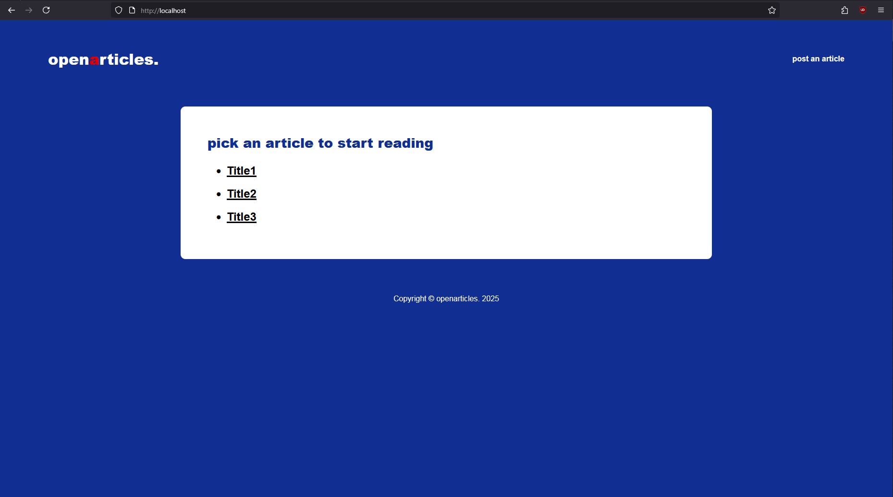

# openarticles

## Overview
Openarticles is an anonymous article-sharing platform, where users can post completely anonymously, acquiring a key for every article they post. Using the post key, the user can later delete or edit their post. This project is one of my first attempts at creating NodeJS endpoints with dynamic EJS templating.

A current limitation of this project is that it lacks persistent storage. This feature is to be implemented in the future using a light database like SQLite. 

This project helped me improve my CSS and UI design skills as I aimed to create a modern looking web application. You are free to examine the code before running it on your machine.

## Concept
While assigning a unique key per post might seem inconvenient, I believe that doing so ensures "true" anonymity of users, since in the case of an anonymous account with a single post management key, information about the user can be inferred from their collection of posts (that are connected under the same anonymous key).

## Code
The application is implemented with NodeJS and ExpressJS, EJS views and simple CSS, database utilization and connection is to be added.

## How To Execute
1. Clone the repository
```bash
git clone https://www.github.com/xMik3/openarticles.git
```

2. Compile and install dependencies (you need to have npm installed)
```bash
npm install
```
3. Execute index.js
```bash
node index.js
```

4. Visit the website
```bash
http://localhost/
```

## User Interface

### Main Page


### Post Article


### View Article


### Edit Article

#### Enter Article ID


#### Edit Article Contents


